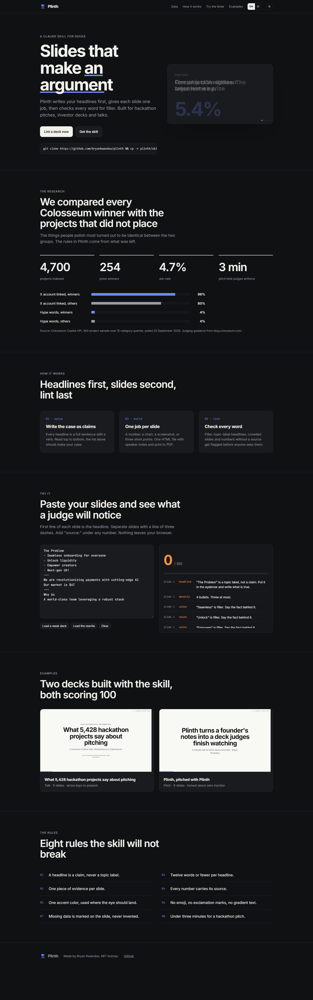
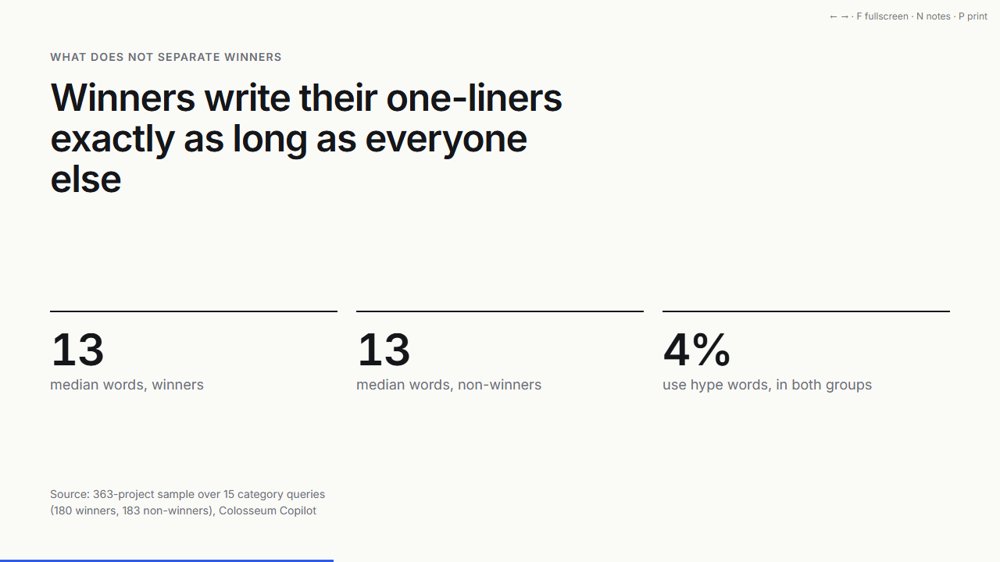

# Plinth

A Claude skill for pitch decks and talks. It writes your headlines first, gives each slide one job, builds a single HTML deck with speaker notes, then lints the words.

Live site with an in-browser linter: https://plinthdeck.vercel.app



## Walkthrough

60-second video of both example decks: https://plinthdeck.vercel.app/walkthrough.mp4 ([file](site/walkthrough.mp4)).

## Audit

A blunt roast, competitor table, Business Model Canvas and SWOT: [docs/AUDIT.md](docs/AUDIT.md).

## PowerPoint, scenarios, languages

- `node skill/plinth/scripts/to-pptx.mjs deck.html` writes an editable 16:9 .pptx with speaker notes. Examples: [talk](examples/talk-5428-projects.pptx), [pitch](examples/pitch-plinth.pptx).
- [references/scenarios.md](skill/plinth/references/scenarios.md): 14 spines, from a 3-minute hackathon video to a board pre-read and a thesis defense.
- [references/languages.md](skill/plinth/references/languages.md): register, number format and hype words for 17 languages; the linter checks all of them. The site itself is in 22 languages.

## Solana devnet receipts

`node skill/plinth/scripts/anchor.mjs deck.html` writes `plinth:v1 sha256=<file hash> score=<lint> slides=<n>` as an SPL Memo. Anyone can check a receipt against a file at https://plinthdeck.vercel.app/anchor.html. All four example decks are recorded:

| Deck | Transaction |
|---|---|
| Talk | [3h8Gd39B…](https://explorer.solana.com/tx/3h8Gd39BZtKtYxPEDvLd9GxpTFdqR7BvTZoRUChrAGQTnDyF6mKR5AxiZEM5gZaKRtfn6zrNAxTYpqLqrN6ebwz7?cluster=devnet) |
| Pitch | [3CxuH1wF…](https://explorer.solana.com/tx/3CxuH1wFzNMpbHUH7Z74jstEViSJbq8djaZcwUknCP4ttYeUyBcUZW8UA6mrWBNzw5zpVjQKSWe62JJ6hQFWcxoX?cluster=devnet) |
| QuantCoin pitch | [3p4Bgyct…](https://explorer.solana.com/tx/3p4BgyctpbyvffbKabsYbF6NT9sTJhc8vkxvKMXKUDzeT7wh5kL2deQ7seaBgrEMVf7JDPjGxyQ2fb8jvs3zkCud?cluster=devnet) |
| QuantCoin talk | [3bJkwEz1…](https://explorer.solana.com/tx/3bJkwEz1Hn4LEh4qjKMKPYsqFF4FVx5Bq7r7hypRgG6GDuMBuChAYTXoEE1qPqJD13kmBEi9AqrLnNSxMsUFZC26?cluster=devnet) |

Tested with the real Phantom extension (v26.30.2, Testnet Mode, Solana Devnet): connect, sign and send, then check. Receipt [5SSrix23…](https://explorer.solana.com/tx/5SSrix23ZnyUTdCj5WSbskKs4DgWY9R3fNX5GdZToxUhTzzNHHms7eH447kxDF5D9uLjsx5FnmXEt5X5Vo2RbaVS?cluster=devnet) came back as a match ([screenshot](docs/evidence/phantom-e2e.png)). On devnet, Phantom shows "Failed to simulate" before you confirm. A plain 1-lamport transfer with no Plinth code in it gets the same warning ([screenshot](docs/evidence/phantom-plain-transfer-same-warning.png)), so the warning comes from Phantom's devnet simulation, not from the memo.

## Install

```bash
git clone https://github.com/bryankwandou/plinth
cp -r plinth/skill/plinth ~/.claude/skills/
```

Then ask Claude Code for a deck: "make a 3-minute hackathon pitch for my project", "review my deck", "susun slide presentasi untuk rapat tim".

## What is in the skill

| Path | Purpose |
|---|---|
| `skill/plinth/SKILL.md` | The workflow: pick a mode, write the spine, one job per slide, build, lint, hand over |
| `references/pitch.md` | Hackathon and investor pitches, with the Colosseum data below |
| `references/talk.md` | Keynotes, updates, teaching (Minto, Duarte, Alley, Lessig) |
| `references/craft.md` | Grid, type scale, color, charts, and the tells of a machine-made deck |
| `references/voice.md` | Words to cut, in English and Indonesian |
| `references/review.md` | Scoring rubric for an existing deck |
| `assets/deck-template.html` | Self-contained deck: arrow keys, `F` fullscreen, `N` notes, `P` print to PDF |
| `scripts/lint-deck.mjs` | Linter CLI; `lint-core.js` is shared with the website |

## The research

Pulled from the Colosseum Copilot API on 25 September 2026: 293 winners out of 5,428 projects (5.4%). In a 363-project sample (180 winners, 183 non-winners), winners and non-winners had the same median one-liner length (13 words) and the same hype-word rate (4%). Every project submitted a pitch. The only visible gap was building in public: 96% of winners linked an X account against 80% of the rest. The conclusion the skill is built on: format is table stakes, and the argument is what wins. Judging guidance comes from Colosseum's "How to Win a Colosseum Hackathon" and "Perfecting Your Hackathon Submission".

## Linter

```bash
node skill/plinth/scripts/lint-deck.mjs deck.html      # or a .txt with slides split by ---
```

| Input | Score |
|---|---|
| [docs/evidence/before.txt](docs/evidence/before.txt) | 24 / 100 ([output](docs/evidence/lint-before.txt)) |
| [docs/evidence/after.txt](docs/evidence/after.txt) | 100 / 100 ([output](docs/evidence/lint-after.txt)) |

It exits non-zero below 90, so it can gate CI.

## Examples

- [Talk: What 5,428 hackathon projects say about pitching](https://plinthdeck.vercel.app/decks/talk-5428-projects.html), 9 slides, lint 100
- [Pitch: Plinth, pitched with Plinth](https://plinthdeck.vercel.app/decks/pitch-plinth.html), 8 slides, lint 100
- [Pitch: QuantCoin, 3-minute hackathon](https://plinthdeck.vercel.app/decks/pitch-quantcoin.html), 10 slides, lint 100
- [Talk: A token cannot make Solana quantum-safe, but a vault can](https://plinthdeck.vercel.app/decks/talk-quantcoin.html), 13 slides, lint 100



## Develop

```bash
node scripts/build-decks.mjs   # examples/*.slides.html -> site/decks/, copies lint-core.js
node --test tests/lint.test.mjs
```

MIT license.
